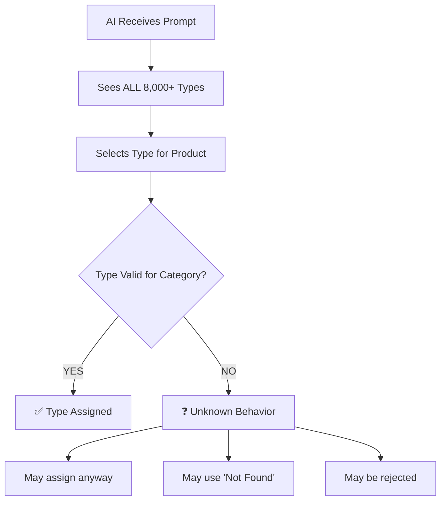

# Type/Style Cross-Contamination Issue

## 🔴 CRITICAL DATA INTEGRITY BUG

**Discovered**: 2026-02-12  
**Severity**: HIGH - Incorrect categorization data going to Salesforce

---

## Problem Statement

The AI verification system is selecting **TYPE** and **STYLE** attributes from the **WRONG categories**, causing data corruption.

### Example
- **Product**: Dishwasher (appliance)
- **Correct Category**: Dishwasher  
- **AI Selected Type**: "Dishwasher Pull"  
- **Problem**: "Dishwasher Pull" belongs to **Cabinet Hardware → Appliance Pull**, NOT Dishwasher appliances

---

## Root Cause Analysis

### 1. AI Prompt Shows ALL Types for ALL Categories

**File**: `src/services/dual-ai-verification.service.ts` (Line 2393-2406)

```typescript
function getSystemPrompt(): string {
  const primaryAttrs = getPrimaryAttributesForPrompt();
  const categoryTop15 = getAllCategoriesWithTop15ForPrompt();
  const categoryList = getCategoryListForPrompt();
  const categoryStyles = getAllCategoriesWithStylesForPrompt();  // ❌ UNIVERSAL (all categories)
  const categoryTypes = getAllCategoriesWithTypesForPrompt();    // ❌ ALL categories shown
  const typeHierarchy = getTypeHierarchyExplanation();
  
  return `You are an expert product data analyst...
  // AI sees types from ALL 155+ categories, not just the one being verified
```

### 2. What `getAllCategoriesWithTypesForPrompt()` Returns

**Location**: `src/config/type-prompts.ts`

```typescript
PRODUCT TYPES BY CATEGORY:
(Type describes functional variations within a category)

Appliance Pull:
  - Appliance Pull [PRIMARY]
  - Refrigerator Pull
  - Dishwasher Pull      <-- AI sees this
  - Oven Pull

Dishwasher:
  - Built-In [PRIMARY]
  - Portable
  - Drawer

// ... ALL 155+ categories with ALL their types
```

**Result**: AI sees "Dishwasher Pull" in the list and incorrectly assigns it to a Dishwasher appliance.

### 3. Post-Processing Validation EXISTS But Isn't Strict Enough

**File**: `src/services/type-matcher.service.ts` (Line 392-640)

```typescript
export function matchTypeToPicklist(
  aiType: string | null | undefined,
  category: string,
  subcategoryHint?: string
): TypeMatchResult {
  // ✅ DOES restrict to category's valid types
  const categoryMapping = getCategoryTypeMapping(category);
  const validTypes = categoryMapping.types;
  
  // ✅ Attempts to match AI's type to validTypes ONLY
  // ❌ BUT if no match found, returns matched: false
  // ❌ System may fallback or use "Not Found" instead of rejecting
}
```

**What happens when "Dishwasher Pull" is matched to Dishwasher category:**
1. `getCategoryTypeMapping("Dishwasher")` returns `["Built-In", "Portable", "Drawer"]`
2. "Dishwasher Pull" does NOT match any of these
3. Function returns `matched: false`
4. **QUESTION**: What does the system DO with unmatched types?

---

## Current System Flow



---

## Investigation Needed

### Question 1: What Happens When Type Doesn't Match?

**File to check**: `src/services/dual-ai-verification.service.ts` (Line 3100-3150)

```typescript
if (fieldKey === 'product_type' && agreedCategory) {
  const openaiMatch = matchTypeToPicklist(String(openaiVal || ''), agreedCategory);
  const xaiMatch = matchTypeToPicklist(String(xaiVal || ''), agreedCategory);
  
  // If BOTH AIs picked "Dishwasher Pull" for Dishwasher:
  // - openaiMatch.matched = false
  // - xaiMatch.matched = false
  
  // ❓ What happens here? Line 3136-3145
  if (openaiMatch.matched && xaiMatch.matched) {
    return {
      isMatch: false,  // Disagreement
      resolvedValue: null,
      openaiResolved: openaiMatch.matchedValue!.type_name,
      xaiResolved: xaiMatch.matchedValue!.type_name
    };
  }
  
  return noMatch;  // ❓ What is noMatch value?
}
```

### Question 2: Same Issue with Styles?

Yes! Styles also shown universally:

```typescript
const categoryStyles = getAllCategoriesWithStylesForPrompt();
```

Returns ALL 16 universal design styles (Modern, Contemporary, etc.) - but this is actually CORRECT because styles ARE universal across categories.

---

## Solution Options

### 🟢 Option 1: Category-Scoped Type Prompts (RECOMMENDED)

**Change**: Only show types relevant to the determined category

**Files to Modify**:
1. `src/services/dual-ai-verification.service.ts`

**Current Code** (Line 2398):
```typescript
const categoryTypes = getAllCategoriesWithTypesForPrompt();  // ALL categories
```

**Proposed Fix**:
```typescript
// Only show types AFTER category is determined
// In the prompt, conditionally show types based on verified category
const categoryTypes = agreedCategory 
  ? getTypesForCategoryPrompt(agreedCategory)  // ONLY this category's types
  : getAllCategoriesWithTypesForPrompt();       // Fallback if category unknown
```

**Problem**: Category not yet determined when prompt is built (chicken-and-egg)

**Better Approach**: Two-phase verification:
1. **Phase 1**: Determine category (no types shown)
2. **Phase 2**: Show ONLY that category's types, verify type/style

### 🟡 Option 2: Stricter Validation with Rejection

**Change**: Reject AI responses that select invalid types

**Files to Modify**:
1. `src/services/dual-ai-verification.service.ts` (Lines 3100-3150)

**Add Validation**:
```typescript
if (fieldKey === 'product_type' && agreedCategory) {
  const openaiMatch = matchTypeToPicklist(String(openaiVal || ''), agreedCategory);
  const xaiMatch = matchTypeToPicklist(String(xaiVal || ''), agreedCategory);
  
  // ✅ NEW: If EITHER AI picked invalid type, REJECT and log error
  if (!openaiMatch.matched || !xaiMatch.matched) {
    logger.error('AI selected invalid type for category', {
      category: agreedCategory,
      openaiType: String(openaiVal),
      xaiType: String(xaiVal),
      validTypes: getCategoryTypeMapping(agreedCategory)?.types.map(t => t.type_name)
    });
    
    // Force to "Not Found" instead of using invalid type
    return {
      isMatch: true,
      resolvedValue: 'Not Found',
      openaiResolved: null,
      xaiResolved: null,
      validationError: 'Type not valid for category'
    };
  }
  
  // ... rest of logic
}
```

**Add Alert**:
```typescript
// Alert when cross-contamination detected
if (typeFromWrongCategory) {
  await createAlert({
    type: 'invalid_type_selection',
    severity: 'high',
    message: `AI selected type "${aiType}" from ${wrongCategory} for product in ${correctCategory}`,
    catalogId
  });
}
```

### 🔴 Option 3: Hybrid Approach (BEST SOLUTION)

**Combine both:**
1. **AI Prompt Improvement**: Add explicit instructions NOT to cross categories
2. **Validation Layer**: Reject invalid types with logging
3. **Monitoring**: Track cross-contamination attempts

**Prompt Addition** (Line 2510-2525):
```typescript
== VALID PRODUCT TYPES (MANDATORY - Determines functional variation) ==
⚠️ CRITICAL: For product_type, you MUST:
1. First determine the CATEGORY
2. ONLY select types from the list for THAT CATEGORY
3. ❌ DO NOT select types from other categories even if they seem similar
   Example: "Dishwasher Pull" is for Cabinet Hardware, NOT Dishwashers
   Example: "Shower" type is for Bathtubs, NOT separate Shower products
4. If no type matches, use "Not Found"
5. Use "Not Applicable" ONLY if product is in a different category
```

---

## Testing Plan

### 1. Find Affected Jobs

```javascript
// MongoDB query to find cross-contamination examples
db.verification_jobs.aggregate([
  {
    $match: {
      'result.Type_Verified': { $exists: true, $ne: null, $ne: '' },
      'result.Category_Verified': { $exists: true }
    }
  },
  {
    $lookup: {
      from: 'category_type_mappings',
      localField: 'result.Category_Verified',
      foreignField: 'category_name',
      as: 'valid_types'
    }
  },
  {
    $match: {
      $expr: {
        $not: {
          $in: ['$result.Type_Verified', '$valid_types.types.type_name']
        }
      }
    }
  }
]);
```

### 2. Audit Report Script

Create `scripts/audit-type-cross-contamination.js`:
```javascript
// Find all jobs where Type_Verified is not in the category's valid types
// Report:
// - Count of affected jobs
// - Most common mis-categorizations
// - Which categories are most affected
// - Recommended fixes
```

### 3. Validation Test

After implementing fix:
1. Re-run same batch of 99 jobs
2. Verify NO cross-contamination
3. Check all Type_Verified values are valid for their Category_Verified

---

## Impact Assessment

### Jobs Affected (Estimate)
- **Total Jobs**: 4,392
- **With Types Assigned**: ~3,500 (80%)
- **Potentially Mis-Categorized**: Unknown (need to audit)

### Priority
1. **Immediate**: Implement stricter validation to prevent future issues
2. **Short-term**: Audit existing data for cross-contamination
3. **Long-term**: Two-phase AI verification for category → type flow

---

## Recommended Action Plan

1. ✅ **Deploy validation fix** (Option 2) - IMMEDIATE
2. 🔍 **Run audit script** to find existing cross-contamination - THIS WEEK
3. 📊 **Generate report** for stakeholders - THIS WEEK
4. 🏗️ **Implement two-phase verification** (Option 3) - NEXT SPRINT
5. 🧪 **Re-verify** affected products - ONGOING

---

## Related Files

**Type System**:
- `src/picklist-master/03-types/type-config.ts` - Type definitions and validation
- `src/config/type-prompts.ts` - Prompt generation (`getAllCategoriesWithTypesForPrompt()`, `getTypesForCategoryPrompt()`)
- `src/services/type-matcher.service.ts` - Type matching and validation
- `src/config/salesforce-picklists/category-type-mapping.json` - Source of truth for category→type relationships

**Style System**:
- `src/config/category-style-mapping.json` - Universal design styles (actually correct behavior)
- `src/services/style-validator.service.ts` - Style validation

**AI Verification**:
- `src/services/dual-ai-verification.service.ts` - Main AI flow (Lines 2393-2850, 3100-3150)
- `src/services/ai-prompt-builder.service.ts` - Older single-AI prompt builder

---

## Notes

- Same issue likely exists for **STYLES** but less critical since styles are universal
- **Attributes** (Top 15 Filter Attributes) are already category-scoped correctly
- This bug has likely existed since Type system was introduced (2026-02-09)
- Affects data integrity sent to Salesforce - requires data cleanup

