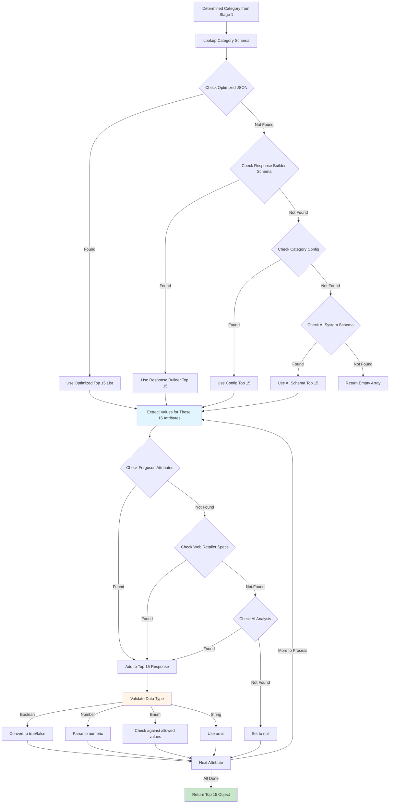
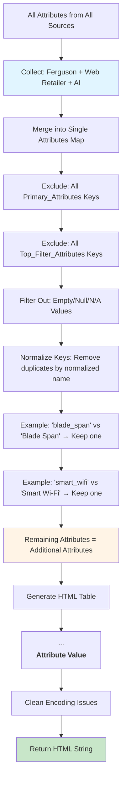
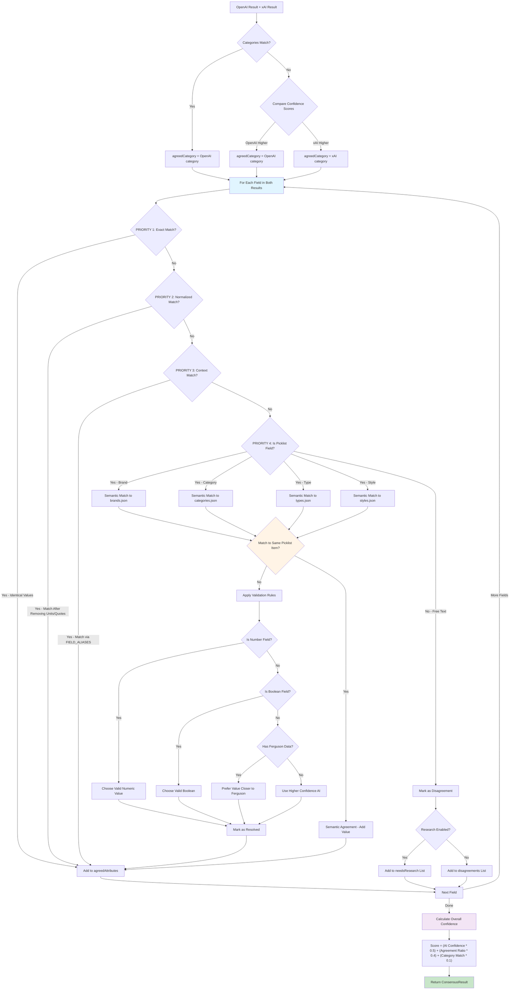
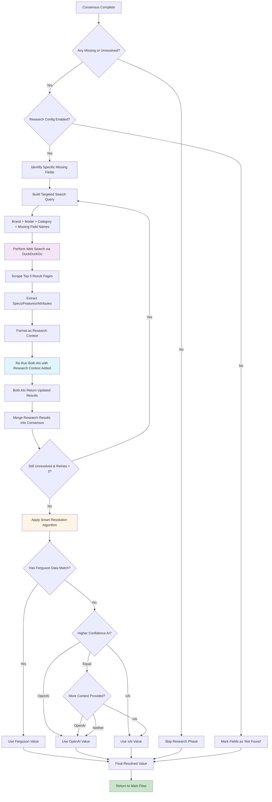
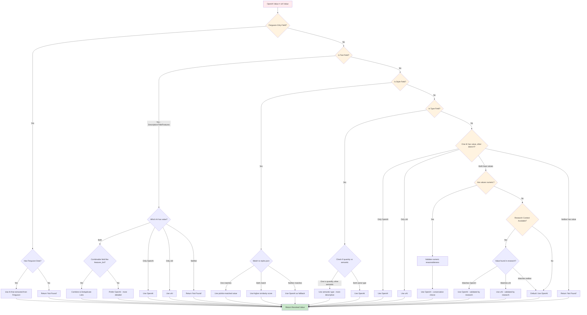
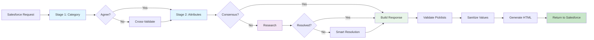

# AI Verification Decision Logic - Complete Breakdown
## How We Make Every Response Decision for Salesforce

**Created**: February 17, 2026  
**Purpose**: Comprehensive documentation of decision logic for all response fields  
**Audience**: Internal development team, stakeholders

---

## Table of Contents

1. [Overview - Two-Stage Dual AI Architecture](#overview)
2. [Response Structure](#response-structure)
3. [Decision Flow - Complete Tree](#decision-flow)
4. [Primary Attributes Decision Logic](#primary-attributes)
5. [Top 15 Filter Attributes Decision Logic](#top-15-filter-attributes)
6. [Additional Attributes HTML Decision Logic](#additional-attributes-html)
7. [Consensus Building Between AIs](#consensus-building)
8. [Research & Retry Logic](#research-retry-logic)
9. [Smart Resolution Algorithm](#smart-resolution)
10. [Field-by-Field Decision Matrix](#field-decision-matrix)

---

## Overview - Two-Stage Dual AI Architecture {#overview}

We use **TWO AI PROVIDERS** (OpenAI + xAI/Grok) running in **TWO STAGES**:

### Stage 1: Category Determination
- **Purpose**: Identify the correct product category ONLY
- **Input**: Raw product data (title, specs, images)
- **Output**: Verified category name
- **Why**: Prevents cross-contamination between category types

### Stage 2: Category-Specific Attribute Extraction
- **Purpose**: Extract all attributes using category-specific prompts
- **Input**: Raw product data + verified category from Stage 1
- **Output**: All primary attributes, top 15 filters, additional attributes
- **Why**: Each category has different relevant attributes (e.g., "Wattage" for lighting, "Capacity" for appliances)

### Dual AI Consensus
- **Both AIs analyze independently** (no communication)
- **Results compared** for agreement
- **Disagreements resolved** through validation rules + picklist matching
- **Research triggered** for missing data

---

## Response Structure {#response-structure}

Every Salesforce verification response contains:

```json
{
  "SF_Catalog_Id": "...",
  "SF_Catalog_Name": "...",
  
  "Primary_Attributes": {
    // 20+ global fields that apply to ALL products
    // Brand, Category, Type, Style, Color, Finish, Dimensions, MSRP, etc.
  },
  
  "Top_Filter_Attributes": {
    // 15 category-specific fields for filtering/facets
    // E.g., Refrigerator: Configuration, Total Capacity, Ice Maker, Counter Depth
    // E.g., Ceiling Fan: Indoor/Outdoor, Blade Count, CFM, Damp Rated
  },
  
  "Top_Filter_Attribute_Ids": {
    // Salesforce IDs for each top 15 attribute
  },
  
  "Additional_Attributes_HTML": "<table>...</table>",
  // HTML table of ALL remaining attributes not in Primary or Top 15
  
  "Media": { ... },
  "Reference_Links": { ... },
  "Documents": { ... },
  "Price_Analysis": { ... },
  "Field_AI_Reviews": { ... },
  "AI_Review_Status": { ... },
  "Verification_Metadata": { ... }
}
```

---

## Decision Flow - Complete Tree {#decision-flow}

```mermaid
graph TB
    Start[Salesforce Sends Product Data] --> DataAnalysis[Analyze Available Data Sources]
    
    DataAnalysis --> |Ferguson + Web Retailer| RichData[Rich Data Scenario]
    DataAnalysis --> |Only Ferguson| FergusonOnly[Ferguson-Only Scenario]
    DataAnalysis --> |Only Web Retailer| WebOnly[Web-Only Scenario]
    DataAnalysis --> |Sparse Data| SparseData[Sparse Data Scenario]
    
    RichData --> PreResearch[Optional: Pre-Research Phase]
    FergusonOnly --> PreResearch
    WebOnly --> PreResearch
    SparseData --> PreResearch
    
    PreResearch --> Stage1[STAGE 1: Category Determination]
    
    Stage1 --> OpenAI_Cat[OpenAI Determines Category]
    Stage1 --> XAI_Cat[xAI Determines Category]
    
    OpenAI_Cat --> CatConsensus{Categories Match?}
    XAI_Cat --> CatConsensus
    
    CatConsensus --> |Yes| AgreedCat[Use Agreed Category]
    CatConsensus --> |No| CrossValidate[Cross-Validation: Each AI Reviews Other's Category]
    
    CrossValidate --> CatResolution{Still Disagree?}
    CatResolution --> |Now Agree| AgreedCat
    CatResolution --> |Still Disagree| HigherConfidence[Use Category from Higher Confidence AI]
    HigherConfidence --> AgreedCat
    
    AgreedCat --> Stage2[STAGE 2: Category-Specific Extraction]
    
    Stage2 --> OpenAI_Attrs[OpenAI: Extract Attributes for THIS Category Only]
    Stage2 --> XAI_Attrs[xAI: Extract Attributes for THIS Category Only]
    
    OpenAI_Attrs --> BuildConsensus[Build Consensus Between Results]
    XAI_Attrs --> BuildConsensus
    
    BuildConsensus --> MatchPriority[Apply Matching Priority for Each Field]
    
    MatchPriority --> P1{Priority 1: Exact Match?}
    P1 --> |Yes| AddToAgreed
    P1 --> |No| P2{Priority 2: Normalized Match?}
    
    P2 --> |Yes| AddToAgreed
    P2 --> |No| P3{Priority 3: Context Match via FIELD_ALIASES?}
    
    P3 --> |Yes| AddToAgreed
    P3 --> |No| P4[Priority 4: Semantic Picklist Match - Last Resort]
    
    P4 --> |Brand| BrandMatcher[Match to brands.json via fuzzy matching]
    P4 --> |Category| CategoryMatcher[Match to categories.json]
    P4 --> |Type| TypeMatcher[Match to types.json for agreed category]
    P4 --> |Style| StyleMatcher[Match to styles.json]
    
    BrandMatcher --> FieldConsensus{Field Values Match?}
    CategoryMatcher --> FieldConsensus
    TypeMatcher --> FieldConsensus
    StyleMatcher --> FieldConsensus
    
    FieldConsensus --> |Agree| AddToAgreed[Add to Agreed Attributes]
    FieldConsensus --> |Disagree| TryExactMatch[Try Exact Match After Normalization]
    
    TryExactMatch --> |Match| AddToAgreed
    TryExactMatch --> |No Match| TryContextMatch[Try Context Match via Aliases]
    
    TryContextMatch --> |Match| AddToAgreed
    TryContextMatch --> |No Match| TrySemanticMatch[Try Semantic Picklist Match - Last Resort]
    
    TrySemanticMatch --> |Match| AddToAgreed
    TrySemanticMatch --> |No Match| ValidationRules[Apply Validation Rules]
    
    ValidationRules --> |Resolved| AddToAgreed
    ValidationRules --> |Unresolved| MarkDisagreement[Mark as Disagreement]
    
    MarkDisagreement --> NeedsResearch{Research Enabled?}
    AddToAgreed --> CheckComplete{All Fields Complete?}
    
    NeedsResearch --> |Yes| ResearchPhase[PHASE 4: Research Missing Fields]
    NeedsResearch --> |No| SkipResearch[Mark as 'Not Found']
    
    ResearchPhase --> WebSearch[Targeted Web Search using Verified Data]
    WebSearch --> ReRunAIs1[Re-Run BOTH AIs with Research - Attempt 1]
    ReRunAIs1 --> MergeResearch1[Merge Results into Consensus]
    
    MergeResearch1 --> RetryCheck1{Still Unresolved?}
    RetryCheck1 --> |No| CheckComplete
    RetryCheck1 --> |Yes Retry 1| ReRunAIs2[Re-Run BOTH AIs - Attempt 2]
    
    ReRunAIs2 --> MergeResearch2[Merge Results Again]
    MergeResearch2 --> RetryCheck2{Still Unresolved?}
    RetryCheck2 --> |No| CheckComplete
    RetryCheck2 --> |Yes Retry 2| ReRunAIs3[Re-Run BOTH AIs - Attempt 3]
    
    ReRunAIs3 --> MergeResearch3[Merge Final Results]
    MergeResearch3 --> RetryCheck3{Still Unresolved?}
    RetryCheck3 --> |No| CheckComplete
    RetryCheck3 --> |Yes All 3 Retries Failed| SmartResolution[SMART RESOLUTION - Final Arbiter]
    
    SmartResolution --> CheckComplete
    SkipResearch --> CheckComplete
    
    CheckComplete --> |No| FieldInference[Smart Field Inference]
    CheckComplete --> |Yes| BuildResponse[Build Final Response]
    
    FieldInference --> BuildResponse
    
    BuildResponse --> MapPrimary[Map to Primary_Attributes]
    BuildResponse --> MapTop15[Map to Top_Filter_Attributes]
    BuildResponse --> MapAdditional[Map to Additional_Attributes_HTML]
    
    MapPrimary --> ValidatePicklists[Validate Against Picklists]
    MapTop15 --> ValidatePicklists
    MapAdditional --> ValidatePicklists
    
    ValidatePicklists --> SanitizeValues[Sanitize for Salesforce]
    SanitizeValues --> GenerateHTML[Generate HTML Tables]
    GenerateHTML --> BuildMetadata[Build Metadata & AI Reviews]
    BuildMetadata --> ReturnToSalesforce[Return Complete Response]
    
    style Stage1 fill:#e1f5ff
    style Stage2 fill:#e1f5ff
    style BuildConsensus fill:#fff4e6
    style ResearchPhase fill:#f3e5f5
    style BuildResponse fill:#e8f5e9
    style ReturnToSaExact match between AI results → Use value<br>2. Normalized match (after cleanup) → Use value<br>3. Context match via FIELD_ALIASES → Use value<br>4. LAST RESORT: Semantic match both to `brands.json`<br>5. If both match same brand → Use it<br>6. If only one matches → Use matched value<br>7. If both match different brands → Use higher confidence AI<br>8. Fallback: Ferguson_Brand → Brand_Web_Retailer | Exact → Context → Semantic (brands.json
```

---

## Primary Attributes Decision Logic {#primary-attributes}

### Global Fields (Apply to ALL Products)

| Field | Decision Logic | Data Sources Priority |
|-------|---------------|----------------------|
| **AI_Brand** | 1. Semantic match both AI results to `brands.json`<br>2. If both match same brand → Use it<br>3. If only one matches → Use matched value<br>4. If both match different brands → Use higher confidence AI<br>5. Fallback: Ferguson_Brand → Brand_Web_Retailer | brands.json (fuzzy match) → Ferguson → Web Retailer |
| **AI_Product_Category** | 1. Stage 1 consensus result<br>2. Normalized to `categories.json` values<br>3. Cross-validation if disagreement<br>4. Higher confidence AI wins if still disagree | Stage 1 AI Consensus → categories.json |
| **AI_Product_Family** | Determined by category group mapping<br>E.g., "Fridge" → "Kitchen Appliances"<br>E.g., "Ceiling Fan" → "Fans & Ventilation" | Department mapping from category-type-mapping.json |
| **AI_Type** | 1. Semantic match to `types.json` for agreed category<br>2. Filter valid types for THIS category only<br>3. AI consensus on product_type field<br>4. Keyword extraction from title/specs<br>5. Ferguson_Product_Type → fallback | types.json (category-filtered) → AI analysis → Ferguson |
| **AI_Type_Id** | Lookup Salesforce ID from types.json after type name resolved | types.json (type_id field) |
| **AI_Style** | 1. If category = Lighting → Validate lighting styles only<br>2. If category = Shower → Validate shower styles only<br>3. Match to `styles.json` for category<br>4. AI consensus if multiple matches | styles.json (category validated) → AI analysis |
| **AI_Color** | Ferguson_Color → Color_Finish_Web_Retailer → AI extraction from title/specs | Ferguson → Web Retailer → AI |
| **AI_Finish** | 1. Ferguson_Finish if available<br>2. Extract from model number (e.g., "BN" = Brushed Nickel)<br>3. AI extraction from specs<br>4. Parse from Color_Finish_Web_Retailer | Ferguson → Model Number Pattern → AI |
| **AI_Depth** | 1. For Lighting: Use "Extension" value (projection distance)<br>2. For other categories: Ferguson_Depth → Depth_Web_Retailer<br>3. Reconcile if AIs swapped depth/width<br>4. Handle circular products (depth = width = diameter) | Ferguson → Web Retailer → Dimension reconciliation |
| **AI_Width** | Ferguson_Width → Width_Web_Retailer → Dimension reconciliation | Ferguson → Web Retailer |
| **AI_Height** | Ferguson_Height → Height_Web_Retailer | Ferguson → Web Retailer |
| **AI_Weight** | Weight_Web_Retailer → Ferguson_Attributes["Product Weight"] → AI extraction | Web Retailer → Ferguson → AI |
| **AI_MSRP** | MSRP_Web_Retailer → Ferguson price fields → AI extraction | Web Retailer → Ferguson → AI |
| **AI_Description** | 1. AI cleanup of Product_Description_Web_Retailer<br>2. Remove encoding issues (’ → ')<br>3. Ferguson_Description as fallback<br>4. Apply corrections from AI if suggested | AI cleaned Web Retailer → Ferguson → AI generation |
| **AI_Product_Title** | 1. AI-generated SEO-optimized title<br>2. Format: "[Brand] [Model] [Key Features] [Type] in [Color/Finish]"<br>3. Target 60-80 characters<br>4. Corrections from AI applied | AI SEO generation from all data |
| **AI_Features** | 1. Parse features from Ferguson_Attributes<br>2. Extract from Web_Retailer_Specs<br>3. AI synthesis of key features<br>4. Generate HTML bullet list | Ferguson + Web Retailer + AI synthesis |
| **AI_UPC_GTIN** | Ferguson_Attributes["UPC"] → AI extraction from specs | Ferguson → AI |
| **AI_Model_Number** | Model_Number_Web_Retailer → Ferguson_Model_Number | Web Retailer → Ferguson |
| **AI_Model_Alias** | Remove all symbols/spaces from model number, uppercase<br>E.g., "FP7500-AB" → "FP7500AB" | Transformation of model number |
| **AI_Model_Parent** | Extract base model (remove variant suffixes)<br>E.g., "FP7500-AB-52" → "FP7500" | Pattern extraction from model number |
| **AI_Model_Variant_Number** | Extract variant code<br>E.g., "FP7500-AB-52" → "AB-52" | Pattern extraction from model number |

---

## Top 15 Filter Attributes Decision Logic {#top-15-filter-attributes}

### Selection Process



### Category-Specific Examples

#### Refrigerator Top 15
1. **Configuration** (enum): French Door, Side-by-Side, Top Freezer, Bottom Freezer
2. **Total Capacity** (number): Cubic feet
3. **Counter Depth** (boolean): true/false
4. **Ice Maker** (enum): None, Standard, Craft Ice, Dual
5. **Fingerprint Resistant** (boolean)
6. **Smart WiFi** (boolean)
7. **Energy Star** (boolean)
8. **Door Alarm** (boolean)
9. **Water Filter** (boolean)
10. **Adjustable Shelves** (boolean)
11. **Through Door Ice** (boolean)
12. **Dual Evaporators** (boolean)
13. **Temperature Controlled Drawer** (boolean)
14. **Color Finish** (string)
15. **Collection** (string)

#### Ceiling Fan Top 15
1. **Indoor** (boolean) - Installation location
2. **Outdoor** (boolean) - Wet-rated capability
3. **Hugger** (boolean) - Flush-mount low-profile
4. **Blade Count** (number) - 3, 4, 5, 6, 8 blades
5. **CFM Rating** (number) - Air movement
6. **Damp Rated** (boolean) - For humid areas
7. **Wet Rated** (boolean) - For exposed outdoor
8. **LED Light** (boolean) - Integrated lighting
9. **Remote Control** (boolean) - Includes remote
10. **Smart WiFi** (boolean) - App control
11. **Reversible Motor** (boolean) - Summer/winter modes
12. **Energy Star** (boolean)
13. **Blade Span** (number) - Fan diameter in inches
14. **Motor Type** (string) - AC/DC
15. **Collection** (string)

### Data Source Priority for Each Attribute

**When extracting values from raw data**, we use this priority:

1. **Ferguson_Attributes** (highest priority - verified supplier data)
   - ✅ Search using: Exact match → Alias match → Contains match (70%+)
2. **Web_Retailer_Specs** (secondary - product detail specs)
   - ✅ Search using: Exact match → Alias match → Contains match (70%+)
3. **AI Analysis Consensus** (both AIs agree on extracted value)
   - ✅ Compared using: Exact match → Normalized match → Context match → Semantic match
4. **AI with Research** (web search performed to find missing data)
5. **Smart Inference** (logical derivation from other fields)
6. **null** (attribute not found/not applicable)

---

## Additional Attributes HTML Decision Logic {#additional-attributes-html}

### Selection Process



### Rules

1. **Exclusion**: Any attribute already in Primary or Top 15 is excluded
2. **Deduplication**: Normalized keys prevent duplicates (e.g., "Smart WiFi" == "smart_wifi")
3. **Validation**: Empty, null, "N/A", "Unknown", "Not Found" → excluded
4. **Formatting**: HTML table with clean encoding
5. **Ordering**: Alphabetical by attribute name

---

## Consensus Building Between AIs {#consensus-building}

### Agreement Algorithm

**CRITICAL: Matching Priority Order**

For comparing two AI results, we use this priority:

1. **Exact Match** (after normalization) - Highest priority
2. **Context Match** (via FIELD_ALIASES) - Second priority  
3. **Semantic Picklist Match** (fuzzy matching to master lists) - Last resort



### Consensus Scoring Formula

```
Overall Confidence = (Average AI Confidence × 0.5) + (Agreement Ratio × 0.4) + (Category Match Bonus × 0.1)

Where:
- Average AI Confidence = (OpenAI confidence + xAI confidence) / 2
- Agreement Ratio = Agreed Fields / (Agreed Fields + Unresolved Disagreements)
- Category Match Bonus = 0.1 if categories match, 0 otherwise
- Result capped at 1.0 (100%)
```

### Resolution Priority

**When Comparing Two AI Results:**

1. **Exact Match** (===) → Use value immediately
2. **Normalized Match** (after removing units, quotes, whitespace) → Use value
3. **Context Match** (via FIELD_ALIASES) → Use matched value
4. **Semantic Picklist Match** (last resort) → Both AIs resolve to same picklist item
5. **Validation Rules** → Apply data type and domain rules
6. **Higher Confidence AI** → Use result from more confident provider
7. **Research Phase** → Trigger web search for missing/unresolved
8. **Smart Resolution** → Use algorithm to pick best value
9. **Mark as "Not Found"** → Last resort if all fails

**When Finding Values in Raw Data:**

1. **Exact Match** on attribute name or field key → Use immediately
2. **Alias Match** from FIELD_ALIASES → Use matched value
3. **Contains Match** with 70%+ overlap threshold → Use matched value
4. **Fuzzy Match** with 50%+ ratio → Use matched value

---

## Research & Retry Logic {#research-retry-logic}

### When Research is Triggered



### Research Query Strategy

**Before Research** (ineffective - vague query):
```
Search: "product specifications"
```

**After Consensus** (effective - targeted query):
```
Search: "Fanimation FP7500AB specifications CFM noise level blade pitch"
         ^Brand     ^Model      ^Category      ^Missing Fields
```

### Retry Loop: Up to 3 Attempts

**The system gives AIs multiple chances to agree:**

```
Initial Disagreement Detected
    ↓
PHASE 4: Trigger Research (web search)
    ↓
════════════════════════════════════════
         RETRY LOOP (MAX 3 TIMES)
════════════════════════════════════════
    ↓
┌─ ATTEMPT 1 ─────────────────────────┐
│ Re-run OpenAI with research context  │
│ Re-run xAI with research context     │
│ Merge Results → Check if resolved    │
└──────────────────────────────────────┘
    ↓
  Still Unresolved? → YES
    ↓
┌─ ATTEMPT 2 ─────────────────────────┐
│ Re-run OpenAI with research context  │
│ Re-run xAI with research context     │
│ Merge Results → Check if resolved    │
└──────────────────────────────────────┘
    ↓
  Still Unresolved? → YES
    ↓
┌─ ATTEMPT 3 (FINAL) ─────────────────┐
│ Re-run OpenAI with research context  │
│ Re-run xAI with research context     │
│ Merge Results → Check if resolved    │
└──────────────────────────────────────┘
    ↓
  Still Unresolved after 3 retries? → YES
    ↓
════════════════════════════════════════
    🔧 SMART RESOLUTION (FINAL CALL)
════════════════════════════════════════
    ↓
Apply field-type aware logic
    ↓
Return final value
```

**Key Details:**
- `MAX_CONSENSUS_RETRIES = 3`
- Each retry includes **both AIs** re-analyzing with research context
- Research context includes web-scraped data, specs, features
- If resolved at any point, loop exits early
- Smart Resolution only runs if **all 3 retries fail** to reach consensus
- **Total AI Opportunities**: 4 (initial + 3 retries)

After 3 retry attempts with unresolved fields:
- 🔧 Apply Smart Resolution algorithm (field-type aware logic)
- Last resort: Mark as "Not Found" (not "Unknown" or "N/A")

---

## Field-by-Field Decision Matrix {#field-decision-matrix}

### Complete Decision Matrix for All Response Fields

| Field Name | Type | Decision Logic | Sources Checked (Priority Order) | Picklist? | Validation Rules |
|------------|------|----------------|----------------------------------|-----------|------------------|
| **SF_Catalog_Id** | string | Passthrough from incoming | Incoming.SF_Catalog_Id | No | Required |
| **SF_Catalog_Name** | string | Passthrough from incoming | Incoming.SF_Catalog_Name | No | Required |
| **AI_Brand** | string | Semantic brand matching | brands.json (fuzzy) → Ferguson → Web Retailer → AI | **Yes** | Must exist in brands.json or request addition |
| **AI_Product_Category** | string | Stage 1 consensus + normalization | Stage 1 Consensus → categories.json | **Yes** | Must exist in categories.json |
| **AI_Product_Family** | string | Department mapping | Department field from category-type-mapping.json | No | Derived from category |
| **AI_Type** | string | Category-filtered type matching | types.json (filtered) → AI → Ferguson → Keyword extraction | **Yes** | Must be valid for determined category |
| **AI_Type_Id** | string | Lookup after type resolved | types.json (type_id field) | **Yes** | Salesforce ID format |
| **AI_Style** | string | Category-validated style matching | styles.json (category validated) → AI | **Yes** | Must be aesthetic style for category |
| **AI_Color** | string | Prefer original source | Ferguson → Web Retailer → AI extraction | No | Free text |
| **AI_Finish** | string | Extraction + pattern matching | Ferguson → Model Number → AI | No | Free text |
| **AI_Depth** | number | Dimension with category logic | Ferguson → Web Retailer → Reconciliation | No | Numeric, inches/cm |
| **AI_Width** | number | Dimension reconciliation | Ferguson → Web Retailer | No | Numeric, inches/cm |
| **AI_Height** | number | Direct dimension | Ferguson → Web Retailer | No | Numeric, inches/cm |
| **AI_Weight** | number | Numeric parsing | Web Retailer → Ferguson → AI | No | Numeric, pounds/kg |
| **AI_MSRP** | number | Price parsing | Web Retailer → Ferguson → AI | No | Numeric currency |
| **AI_Description** | string | AI cleanup + encoding fix | AI cleaned Web Retailer → Ferguson | No | Free text, max 5000 chars |
| **AI_Product_Title** | string | SEO title generation | AI generation from all data | No | 60-80 chars optimal |
| **AI_Features** | html | Feature bullet list | Ferguson + Web Retailer + AI | No | HTML `<ul>` format |
| **AI_UPC_GTIN** | string | Direct extraction | Ferguson.UPC → AI specs | No | 12-14 digits |
| **AI_Model_Number** | string | Prefer web retailer model | Web Retailer → Ferguson | No | Free text |
| **AI_Model_Alias** | string | Transform model number | Remove symbols, uppercase | No | Alphanumeric only |
| **AI_Model_Parent** | string | Extract base model | Pattern extraction (remove variant) | No | Derived from model |
| **AI_Model_Variant_Number** | string | Extract variant code | Pattern extraction (suffix) | No | Derived from model |
| **Top_Filter_Attributes[*]** | varied | Category-specific schema | Schema Top 15 → Ferguson → Web Retailer → AI | Some | Type validated per attribute |
| **Additional_Attributes_HTML** | html | Everything else as table | All sources minus Primary minus Top15 | No | HTML `<table>` format |
| **Media.Primary_Image** | url | Image URL selection | Stock_Images[0] or AI selection | No | Valid URL |
| **Media.Additional_Images** | array | Remaining images | Stock_Images[1..n] | No | Array of valid URLs |
| **Reference_Links** | object | URL references | Ferguson_URL → Web_Retailer_URL → Research URLs | No | Valid URLs |
| **Documents[*]** | array | Document evaluation | AI evaluation of provided Documents | No | Use/Skip/Review recommendation |
| **Price_Analysis** | object | Price logic | MSRP → Market analysis | No | Price breakdown |
| **Field_AI_Reviews** | object | Per-field AI details | OpenAI + xAI results per field | No | Consensus metadata |
| **AI_Review_Status** | object | Summary of AI agreement | OpenAI + xAI review status | No | Agreement indicators |
| **Verification_Metadata** | object | Processing details | Session ID, timestamps, retries | No | Metadata tracking |

---

## Smart Resolution Algorithm - Final Conflict Resolver {#smart-resolution}

**When Used**: After **3 retry attempts with research context** and two AIs STILL disagree.

**Purpose**: Intelligently pick the best value based on field type, context, and data quality rather than just choosing randomly.

### ⚠️ IMPORTANT: Smart Resolution is the LAST RESORT

Smart Resolution only runs **AFTER** the following attempts:

1. ✅ Initial consensus building (exact, normalized, context, semantic matching)
2. ✅ **PHASE 4**: Research phase triggered (web search for missing data)
3. ✅ **Re-run #1**: Both AIs analyze again WITH research context
4. ✅ Merge results, check if resolved
5. ✅ **Re-run #2**: If still unresolved, both AIs try again
6. ✅ Merge results, check if resolved
7. ✅ **Re-run #3**: If still unresolved, both AIs try one more time (MAX_CONSENSUS_RETRIES = 3)
8. ✅ Merge results, check if resolved
9. 🔧 **Smart Resolution**: Only NOW, after 3 retry attempts, do we apply Smart Resolution

**So the AIs get 4 total chances** to agree:
- Initial attempt
- Retry #1 with research
- Retry #2 with research
- Retry #3 with research

**Then Smart Resolution makes the final call.**

### Smart Resolution Priority Logic



### Smart Resolution Rules by Field Type

| Field Type | Resolution Logic | Reason |
|------------|------------------|--------|
| **Ferguson-Only Fields** | `model_variant_number`, `total_model_variants` | Only trust Ferguson data - too error-prone for AI inference<br>✅ Use AI that extracted from Ferguson<br>❌ Return "Not Found" if no Ferguson data |
| **Text Fields** | `description`, `product_title`, `features_list` | Allow natural variation between AIs<br>✅ Combine feature lists (deduplicate)<br>✅ Prefer OpenAI for descriptions (more detailed)<br>✅ Use whichever AI provided content |
| **Style Fields** | `style`, `product_style` | Match against styles.json picklist<br>✅ Use AI whose value matches picklist<br>✅ Use AI with higher similarity score<br>✅ Fallback to OpenAI if neither matches |
| **Type Fields** | `type`, `product_type` | Distinguish quantity vs semantic<br>✅ "Built-in Oven" (semantic) > "Single" (quantity)<br>✅ Prefer descriptive type over structural count<br>✅ Fallback to OpenAI |
| **One AI Only** | Any field | Only one AI found a value<br>✅ Use the AI that provided a value<br>❌ Return "Not Found" if neither found value |
| **Numeric Fields** | Dimensions, weight, prices, counts | Validate reasonableness<br>✅ Prefer OpenAI (conservative choice)<br>⚠️ Could add range validation (future) |
| **Research Validated** | Any field with research context | Web search found authoritative data<br>✅ Use AI whose value matches research<br>✅ Builds confidence in AI choice<br>✅ Fallback to OpenAI if no match |
| **Default Fallback** | All other fields | When all else fails<br>✅ Use OpenAI (generally more conservative)<br>📝 Log reason for audit trail |

### Return Structure

```typescript
interface DisagreementResolution {
  resolvedValue: any;           // The chosen value
  winner: 'openai' | 'xai' | 'combined' | 'not_found';
  reason: string;               // Human-readable explanation
}
```

### Example Scenarios

#### Scenario 1: Text Field - Features List
```
OpenAI: "<ul><li>LED lighting</li><li>Energy Star certified</li></ul>"
xAI:    "<ul><li>LED Lighting</li><li>Quiet operation</li></ul>"

Smart Resolution:
✅ COMBINED: "<ul><li>LED lighting</li><li>Energy Star certified</li><li>Quiet operation</li></ul>"
✅ Reason: "Combined features from both AIs"
✅ Deduplication: "LED lighting" appeared in both (case-insensitive match)
```

#### Scenario 2: Style Field - Picklist Matching
```
OpenAI: "Contemporary"          → Matches styles.json (similarity: 95%)
xAI:    "Modern Contemporary"   → Matches styles.json (similarity: 78%)

Smart Resolution:
✅ OPENAI: "Contemporary"
✅ Reason: "OpenAI style closer to picklist (95% vs 78%)"
```

#### Scenario 3: Type Field - Quantity vs Semantic
```
OpenAI: "Built-in Dishwasher"   → Semantic (describes function)
xAI:    "Single"                → Quantity (describes count)

Smart Resolution:
✅ OPENAI: "Built-in Dishwasher"
✅ Reason: "OpenAI provides semantic type, xAI provided quantity"
```

#### Scenario 4: Research Validation
```
OpenAI: "Brushed Nickel"
xAI:    "Satin Nickel"
Research: Found "Brushed Nickel" in manufacturer specs

Smart Resolution:
✅ OPENAI: "Brushed Nickel"
✅ Reason: "OpenAI matches research data"
```

#### Scenario 5: One AI Only
```
OpenAI: "42 dB"
xAI:    "Not Found"

Smart Resolution:
✅ OPENAI: "42 dB"
✅ Reason: "Only OpenAI found a value"
```

#### Scenario 6: Ferguson-Only Field
```
Field: model_variant_number
OpenAI: "AB-52" (inferred)
xAI:    "AB52" (inferred)
Ferguson Data: Not available

Smart Resolution:
❌ NOT_FOUND: "Not Found"
❌ Reason: "model_variant_number should only come from Ferguson data which is not available"
```

### Special Field Sets

```typescript
// Fields that can be combined rather than choosing one
COMBINABLE_FIELDS = ['features_list', 'features']

// Text fields - accept variation between AIs
TEXT_FIELDS = ['description', 'product_title', 'details', 'features_list', 'features']

// Must come from Ferguson (not AI inference)
FERGUSON_ONLY_FIELDS = ['model_variant_number', 'total_model_variants']
```

### Why Smart Resolution is Needed

**Without Smart Resolution**:
- ❌ Random choice between two values
- ❌ Loss of good data from one AI
- ❌ No context-aware decision making
- ❌ No audit trail for why value was chosen

**With Smart Resolution**:
- ✅ Context-aware intelligent choice
- ✅ Combines data when appropriate (features)
- ✅ Uses field-specific logic (style vs type)
- ✅ Validates against research/picklists
- ✅ Full audit trail with reason

### When It Runs

Smart Resolution is the **last step** before returning "Not Found":

1. ✅ Exact match → Use value
2. ✅ Normalized match → Use value
3. ✅ Context match → Use value
4. ✅ Semantic picklist match → Use value
5. ✅ Validation rules → Apply rules
6. ⚠️ **Research phase** → Web search for missing data
7. ⚠️ **Retry #1** → Both AIs re-analyze WITH research context
8. ⚠️ **Retry #2** → Both AIs try again if still unresolved
9. ⚠️ **Retry #3** → Both AIs try one final time (MAX_CONSENSUS_RETRIES)
10. 🔧 **Smart Resolution** → Intelligent final choice AFTER 3 retries exhausted
11. ❌ "Not Found" → Only if Smart Resolution returns not_found

---

## Two Types of Matching - Different Priority Orders

### Type 1: Comparing AI Results Against Each Other

**Scenario**: OpenAI says "Built-in" and xAI says "Single" for product_type field

**Priority Order**:
1. ✅ **Exact Match** - "Built-in" === "Built-in" → Use immediately
2. ✅ **Normalized Match** - After removing units/quotes/whitespace
3. ✅ **Context Match** - Via FIELD_ALIASES (e.g., "Installation Type" = "Mount Type")
4. ⚠️ **Semantic Picklist Match** (LAST RESORT) - Match both to types.json, check if same type_id

**Why This Order**: We trust literal agreement over fuzzy matching. Only use semantic matching when values don't match exactly but might mean the same thing.

### Type 2: Finding Values in Raw Data

**Scenario**: Looking for "Installation Type" value in Ferguson_Attributes array

**Priority Order**:
1. ✅ **Exact Match** - Attribute name === "Installation Type" → Use immediately
2. ✅ **Alias Match** - Attribute name matches FIELD_ALIASES entry
3. ⚠️ **Contains Match** - 70%+ overlap threshold (e.g., "Install Type" ≈ "Installation Type")
4. ⚠️ **Fuzzy Match** - 50%+ ratio (rarely used)

**Why This Order**: Raw data has unpredictable attribute names. We check exact first, then known aliases, then fuzzy match as last resort.

---

## Key Decision Points Summary

### 1. Stage 1: Category Determination
- **Input**: Raw product data
- **Process**: Both AIs determine category independently
- **Consensus**: Must agree or cross-validate
- **Output**: Single agreed category
- **Why Critical**: Wrong category = wrong Top 15 attributes

### 2. Stage 2: Attribute Extraction
- **Input**: Raw product data + agreed category
- **Process**: Category-specific prompts to both AIs
- **Consensus**: Field-by-field semantic matching
- **Output**: All attributes with confidence scores

### 3. Semantic Picklist Matching
- **Purpose**: Recognize "Built-in Oven" and "Single Oven" as same type
- **Process**: Fuzzy matching to master picklists
- **When Used**: **LAST RESORT** - only when exact and context matches fail
- **Benefit**: Reduces false disagreements for picklist fields

### 4. Validation Rules
- **Data Types**: Enforce boolean, number, enum, string
- **Domain Rules**: Category-specific valid values
- **Ferguson Priority**: Prefer verified supplier data

### 5. Research Phase
- **Trigger**: Missing or unresolved fields after consensus
- **Query**: Targeted using verified brand/model/category
- **Limit**: Max 3 retry attempts
- **Fallback**: Smart resolution algorithm

### 6. Smart Resolution Algorithm
- **Field-Type Aware**: Different logic for text, style, type, numeric fields
- **Ferguson-Only Fields**: Only trust Ferguson data for certain fields (e.g., model variants)
- **Text Fields**: Combine features, prefer more detailed descriptions
- **Style/Type Fields**: Validate against picklists, choose best match
- **Research Validation**: Prefer AI value that matches research findings
- **One AI Only**: Use the AI that found a value
- **Default**: Use OpenAI (generally more conservative)
- **Last Resort**: "Not Found" only if both AIs found nothing

### 7. Response Building
- **Primary**: 20+ global fields
- **Top 15**: Category-specific filter attributes
- **Additional**: Everything else as HTML table
- **Validation**: Sanitize all values for Salesforce JSON parsing

---

## Visual Decision Tree - High Level



---

## Conclusion

This document provides the **complete decision logic** for every field in Salesforce verification responses. The system uses:

1. **Two-stage dual AI architecture** for accuracy
2. **Semantic picklist matching** to reduce false disagreements
3. **Validation rules** for data quality
4. **Research phase** for missing data
5. **Smart resolution** for final conflicts
6. **Category-specific schemas** for relevant attributes

Every decision is traceable through this logic tree, enabling:
- **Debugging**: Why did we choose this value?
- **Optimization**: Where can we improve accuracy?
- **Auditing**: Is the decision logic sound?
- **Training**: How do new developers understand the system?

---

**Document Version**: 1.1  
**Last Updated**: February 17, 2026 (Corrected: Matching priority + Smart Resolution retry flow) 
**Maintained By**: Development Team

---

## Quick Reference: Matching Priority Cheat Sheet

### 🔍 When Comparing Two AI Results

```
Priority 1: EXACT MATCH             → "Built-in" === "Built-in" ✅
Priority 2: NORMALIZED MATCH        → "60 inches" === "60 in" ✅ (after removing units)
Priority 3: CONTEXT MATCH           → "Installation Type" === "Mount Type" ✅ (via FIELD_ALIASES)
Priority 4: SEMANTIC PICKLIST       → "Built-in" → type_id:123, "Single" → type_id:123 ✅ (last resort)
Priority 5: VALIDATION RULES        → Apply data type/domain rules
Priority 6: RESEARCH PHASE          → Web search for missing data
Priority 7: AI RETRY #1 WITH RESEARCH → Both AIs re-analyze with research context
Priority 8: AI RETRY #2 WITH RESEARCH → Both AIs try again if still unresolved
Priority 9: AI RETRY #3 WITH RESEARCH → Both AIs final attempt (MAX_CONSENSUS_RETRIES)
Priority 10: SMART RESOLUTION       → Field-type aware choice AFTER 3 retries fail
Priority 11: FINAL FALLBACK         → "Not Found" (only if all above fail)
```

### 📋 When Finding Values in Raw Data

```
Priority 1: EXACT MATCH          → attribute.name === "Installation Type" ✅
Priority 2: ALIAS MATCH          → attribute.name in FIELD_ALIASES["installation_type"] ✅
Priority 3: CONTAINS MATCH       → "Install Type" contains "Installation" (70%+ overlap) ⚠️
Priority 4: FUZZY MATCH          → "Inst Type" ~ "Installation Type" (50%+ ratio) ⚠️
```

### 🔧 Smart Resolution Field Types

```
Ferguson-Only:  model_variant_number, total_model_variants → Only from Ferguson
Text Fields:    description, product_title, features → Combine or prefer detailed
Style Fields:   style, product_style → Match to picklist, use best similarity
Type Fields:    type, product_type → Prefer semantic over quantity
One AI Only:    Any field → Use the AI that found a value
Numeric:        dimensions, weight, price → Prefer OpenAI (conservative)
Research Match: Any field → Use AI that matches web research
Default:        All others → Use OpenAI as fallback
```

**Rule**: Exact and context matching are TRUSTED. Semantic/fuzzy matching is LAST RESORT. Smart Resolution is FINAL ARBITER.

---

## Summary: What Happens When AIs Disagree

**Quick Answer**: They get **4 chances** to figure it out before Smart Resolution makes the final call.

### The Complete Flow:

1. **Initial Analysis** (Chance #1)
   - Both AIs analyze product independently
   - Results compared using exact → normalized → context → semantic matching
   - ✅ If agree → Use value
   - ❌ If disagree → Continue to research phase

2. **Research Phase Triggered**
   - System performs web search for missing data
   - Scrapes manufacturer specs, features, reviews
   - Formats research context for AIs

3. **Retry #1 with Research** (Chance #2)
   - **BOTH AIs re-analyze** WITH research context added to prompt
   - More data = better chance of agreement
   - Results merged back into consensus
   - ✅ If now agree → Use value
   - ❌ If still disagree → Continue

4. **Retry #2 with Research** (Chance #3)
   - **BOTH AIs analyze AGAIN** with same research context
   - Sometimes AIs need multiple passes to extract correctly
   - Results merged again
   - ✅ If now agree → Use value
   - ❌ If still disagree → Continue

5. **Retry #3 with Research** (Chance #4 - Final)
   - **BOTH AIs make final attempt** with research context
   - Last chance for consensus
   - Results merged final time
   - ✅ If now agree → Use value
   - ❌ If STILL disagree after 3 retries → **Smart Resolution**

6. **Smart Resolution** (Last Resort)
   - Only runs after all 4 chances exhausted
   - Field-type aware intelligent choice:
     - **Ferguson-Only Fields**: Only trust Ferguson data
     - **Text Fields**: Combine or prefer detailed version
     - **Style Fields**: Match to picklist, use best similarity
     - **Type Fields**: Prefer semantic over quantity
     - **Research Match**: Use AI that matches web data
     - **Default**: Use OpenAI (conservative)
   - Returns final value with reason logged

7. **"Not Found"**
   - Only if Smart Resolution determines neither AI found valid data
   - Never "Unknown" or "N/A"

### Example Timeline

```
00:00 - Initial AI analysis
        OpenAI: "Brushed Nickel"
        xAI:    "Satin Nickel"
        Result: DISAGREEMENT

00:05 - Trigger research phase
        Web search: "Fanimation FP7500AB finish specifications"
        Found: Manufacturer specs, retailer pages

00:10 - RETRY #1 (with research context)
        OpenAI: "Brushed Nickel" (confidence: 85%)
        xAI:    "Brushed Nickel" (confidence: 82%)
        Result: ✅ AGREEMENT REACHED

00:15 - Use agreed value: "Brushed Nickel"
        (Retries #2 and #3 skipped, Smart Resolution not needed)
```

### If All 3 Retries Fail

```
00:00 - Initial analysis → DISAGREEMENT
00:05 - RETRY #1 → STILL DISAGREE
00:10 - RETRY #2 → STILL DISAGREE  
00:15 - RETRY #3 → STILL DISAGREE (all retries exhausted)
00:20 - 🔧 SMART RESOLUTION ENGAGED
        Analyzes field type (e.g., "finish" = free text)
        Checks if either matches Ferguson data
        Defaults to OpenAI if no clear winner
        Result: "Brushed Nickel" (OpenAI)
        Reason: "Ferguson data matches OpenAI value"
```

**Bottom Line**: Smart Resolution is NOT the first response to disagreement - it's the LAST resort after giving both AIs 4 chances (initial + 3 retries with research) to reach consensus.
