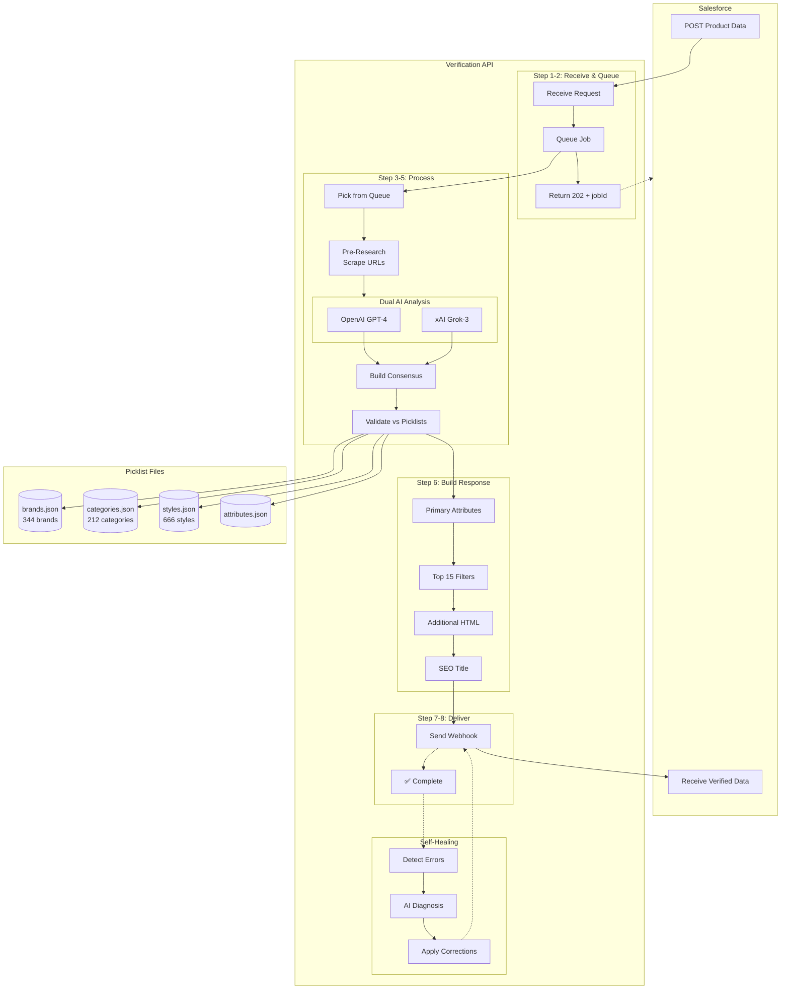

# Catalog Verification API - Complete Process Flowchart

**Last Updated:** February 8, 2026

---

## High-Level Overview

```
┌─────────────────────────────────────────────────────────────────────────────────┐
│                        CATALOG VERIFICATION API FLOW                             │
├─────────────────────────────────────────────────────────────────────────────────┤
│                                                                                  │
│   SALESFORCE                    VERIFICATION API                   SALESFORCE   │
│   ══════════                    ════════════════                   ══════════   │
│                                                                                  │
│   Product Data ──────►  POST /api/verify/salesforce  ──────►  Verified Data    │
│                                      │                                          │
│                                      ▼                                          │
│                         ┌─────────────────────────┐                             │
│                         │   8-STEP VERIFICATION   │                             │
│                         │   + SELF-HEALING        │                             │
│                         └─────────────────────────┘                             │
│                                                                                  │
└─────────────────────────────────────────────────────────────────────────────────┘
```

---

## Complete Process Tree

```
SALESFORCE INITIATES REQUEST
│
├─► STEP 1: API RECEIVES REQUEST
│   │
│   ├── POST /api/verify/salesforce
│   │   ├── Headers: X-API-KEY (authentication)
│   │   └── Body: Raw product data (SF_Catalog_Id, URLs, Ferguson_Raw_Data, etc.)
│   │
│   └── controllers/salesforce-verification.controller.ts
│       ├── Validate API key
│       ├── Extract SF_Catalog_Id, SF_Catalog_Name
│       └── Create verification job
│
├─► STEP 2: JOB QUEUED
│   │
│   ├── models/verification-job.model.ts
│   │   ├── Status: "pending"
│   │   ├── jobId: UUID generated
│   │   ├── Store raw payload
│   │   └── Record createdAt timestamp
│   │
│   └── Immediate 202 Response to Salesforce
│       └── { jobId, status: "pending", message: "Verification queued" }
│
├─► STEP 3: BACKGROUND PROCESSOR PICKS UP JOB
│   │
│   ├── services/async-verification-processor.service.ts
│   │   ├── Polls every 5 seconds
│   │   ├── Max 20 concurrent jobs (configured in index.ts)
│   │   └── FIFO queue (oldest first)
│   │
│   └── Job transitions: pending → processing
│
├─► STEP 4: UPDATE STATUS TO PROCESSING
│   │
│   └── Save startedAt timestamp
│
├─► STEP 5: EXECUTE AI VERIFICATION (Dual-AI Engine)
│   │
│   ├─► services/dual-ai-verification.service.ts
│   │   │
│   │   ├─► PHASE 0: DATA SOURCE ANALYSIS
│   │   │   │
│   │   │   ├── 0.0: Analyze incoming data sources
│   │   │   │   ├── Ferguson_Raw_Data
│   │   │   │   ├── Web_Retailer_Raw_Data
│   │   │   │   ├── Procurement_Raw_Data
│   │   │   │   └── Legacy_Data
│   │   │   │
│   │   │   ├── 0.1: Validate data coherence
│   │   │   │   └── Ensure sources describe SAME product
│   │   │   │
│   │   │   └── 0.5: Pre-fetch external research data
│   │   │       │
│   │   │       └── services/research.service.ts
│   │   │           ├── Scrape Ferguson URL
│   │   │           ├── Scrape Web Retailer URL
│   │   │           ├── Scrape Manufacturer URL
│   │   │           ├── Extract specs from HTML
│   │   │           └── Parse product images
│   │   │
│   │   ├─► PHASE 1: DUAL AI ANALYSIS
│   │   │   │
│   │   │   ├── OpenAI Analysis (gpt-4-turbo-preview)
│   │   │   │   │
│   │   │   │   ├── services/openai.service.ts
│   │   │   │   │   ├── Build prompt with all context
│   │   │   │   │   ├── Include pre-research results
│   │   │   │   │   └── Request structured JSON response
│   │   │   │   │
│   │   │   │   └── Returns:
│   │   │   │       ├── category, brand, style
│   │   │   │       ├── dimensions, weight, MSRP
│   │   │   │       ├── color, finish, material
│   │   │   │       ├── top 15 filter attributes
│   │   │   │       └── confidence scores
│   │   │   │
│   │   │   └── xAI Analysis (grok-3)
│   │   │       │
│   │   │       ├── services/xai.service.ts
│   │   │       │   ├── Same structured prompt
│   │   │       │   └── Independent analysis
│   │   │       │
│   │   │       └── Returns: Same structure as OpenAI
│   │   │
│   │   ├─► PHASE 2: BUILD CONSENSUS
│   │   │   │
│   │   │   ├── services/consensus.service.ts
│   │   │   │   │
│   │   │   │   ├── Compare OpenAI vs xAI responses
│   │   │   │   │   ├── Field-by-field comparison
│   │   │   │   │   ├── Track agreed vs disagreed
│   │   │   │   │   └── Calculate consensus score
│   │   │   │   │
│   │   │   │   ├── Resolution Rules:
│   │   │   │   │   ├── Both agree → Use value
│   │   │   │   │   ├── One empty → Use non-empty
│   │   │   │   │   ├── Both disagree → Flag for review
│   │   │   │   │   └── Confidence tiebreaker
│   │   │   │   │
│   │   │   │   └── Output: Consensus score (0-100)
│   │   │   │
│   │   │   └── Scoring Breakdown:
│   │   │       ├── Agreement ratio
│   │   │       ├── Average AI confidence
│   │   │       └── Category bonus (+10 if agree)
│   │   │
│   │   ├─► PHASE 3: CROSS-VALIDATION (if disagreement)
│   │   │   │
│   │   │   ├── Category disagreement detected
│   │   │   │   └── OpenAI: "Bathroom Faucets" vs xAI: "Tub Faucets"
│   │   │   │
│   │   │   ├── Cross-validate with picklists
│   │   │   │   │
│   │   │   │   └── services/picklist-matcher.service.ts
│   │   │   │       ├── Load categories.json
│   │   │   │       ├── Find closest match
│   │   │   │       └── Use Salesforce category_id
│   │   │   │
│   │   │   └── Re-ask both AIs with context
│   │   │
│   │   ├─► PHASE 4: ADDITIONAL RESEARCH
│   │   │   │
│   │   │   ├── For missing/unresolved fields:
│   │   │   │   ├── dimensions, weight, MSRP
│   │   │   │   ├── UPC/GTIN
│   │   │   │   └── model variants
│   │   │   │
│   │   │   ├── services/research.service.ts
│   │   │   │   ├── Deep scrape manufacturer site
│   │   │   │   ├── Parse spec sheets (PDFs)
│   │   │   │   └── Extract from images (OCR)
│   │   │   │
│   │   │   └── Re-run AI with new data
│   │   │
│   │   ├─► PHASE 5: RETRY UNRESOLVED (up to 3 attempts)
│   │   │   │
│   │   │   ├── Still have disagreements?
│   │   │   │   ├── Ask AIs to reconsider
│   │   │   │   └── Provide opposing viewpoint
│   │   │   │
│   │   │   └── Max 3 retry attempts
│   │   │
│   │   └─► PHASE 6: FINAL WEB SEARCH
│   │       │
│   │       ├── Use verified data for targeted search
│   │       │   ├── "{brand} {model_number} specifications"
│   │       │   └── Cross-reference found data
│   │       │
│   │       └── Merge if both AIs agree on findings
│   │
│   ├─► PICKLIST VALIDATION & MATCHING
│   │   │
│   │   ├── services/picklist-matcher.service.ts
│   │   │   │
│   │   │   ├── BRAND MATCHING
│   │   │   │   ├── Load: src/config/salesforce-picklists/brands.json
│   │   │   │   │   └── 344 brands with brand_id
│   │   │   │   ├── Fuzzy match brand name
│   │   │   │   └── Return: Brand_Verified, Brand_Id
│   │   │   │
│   │   │   ├── CATEGORY MATCHING
│   │   │   │   ├── Load: src/config/salesforce-picklists/categories.json
│   │   │   │   │   └── 212 categories with category_id
│   │   │   │   ├── Match to singular form (Chandelier, not Chandeliers)
│   │   │   │   │
│   │   │   │   ├── services/category-matcher.service.ts
│   │   │   │   │   ├── DEPARTMENT_CATEGORIES lookup
│   │   │   │   │   ├── CATEGORY_KEYWORDS mapping
│   │   │   │   │   └── Infer department from category
│   │   │   │   │
│   │   │   │   └── Return: Category_Verified, Category_Id, SubCategory_Verified
│   │   │   │
│   │   │   ├── STYLE MATCHING
│   │   │   │   ├── Load: src/config/salesforce-picklists/styles.json
│   │   │   │   │   └── 666 styles (category-specific)
│   │   │   │   ├── Filter by category
│   │   │   │   └── Return: Product_Style_Verified, Style_Id
│   │   │   │
│   │   │   └── ATTRIBUTE MATCHING
│   │   │       ├── Load: src/config/salesforce-picklists/attributes.json
│   │   │       │   └── All SF attribute definitions
│   │   │       ├── Load: category-filter-attributes.json
│   │   │       │   └── Top 15 per category with SF IDs
│   │   │       └── Return: Top_15_Filter_Attributes with attribute_ids
│   │   │
│   │   └── config/constants.ts
│   │       ├── PREMIUM_BRANDS list
│   │       ├── CATEGORY_NAME_ALIASES
│   │       └── Hardcoded mappings
│   │
│   ├─► SEO TITLE GENERATION
│   │   │
│   │   └── services/seo-title-generator.service.ts
│   │       ├── Category-specific title schemas
│   │       ├── 60-80 character target
│   │       └── Include: Brand, Size, Style, Category, Finish
│   │
│   └─► RESPONSE BUILDING
│       │
│       └── services/response-builder.service.ts
│           │
│           ├── Primary_Attributes (20 fields)
│           │   ├── Brand_Verified, Brand_Id
│           │   ├── Category_Verified, Category_Id
│           │   ├── SubCategory_Verified
│           │   ├── Product_Family_Verified
│           │   ├── Department_Verified
│           │   ├── Product_Style_Verified, Style_Id
│           │   ├── Color_Verified, Finish_Verified
│           │   ├── Depth_Verified, Width_Verified, Height_Verified
│           │   ├── Weight_Verified
│           │   ├── MSRP_Verified
│           │   ├── Description_Verified
│           │   ├── Product_Title_Verified
│           │   ├── Details_Verified
│           │   ├── Features_List_HTML
│           │   ├── UPC_GTIN_Verified
│           │   ├── Model_Number_Verified
│           │   ├── Model_Number_Alias
│           │   ├── Model_Parent
│           │   ├── Model_Variant_Number
│           │   └── Total_Model_Variants
│           │
│           ├── Top_15_Filter_Attributes (category-specific)
│           │   ├── material, installation_type, flow_rate_gpm, etc.
│           │   └── Each with Salesforce attribute_id
│           │
│           ├── Top_Filter_Attribute_Ids
│           │   └── Map of attribute_key → SF attribute_id
│           │
│           ├── Additional_Attributes_HTML
│           │   └── HTML table of remaining specs
│           │
│           ├── Price_Analysis
│           │   ├── msrp_web_retailer
│           │   └── msrp_ferguson
│           │
│           ├── Media
│           │   ├── Primary_Image_URL
│           │   ├── All_Image_URLs
│           │   └── Image_Count
│           │
│           ├── Reference_Links
│           │   ├── Ferguson_URL
│           │   ├── Web_Retailer_URL
│           │   └── Manufacturer_URL
│           │
│           └── Research_Analysis
│               ├── research_performed: true/false
│               └── total_resources_analyzed
│
├─► STEP 6: VERIFICATION COMPLETE
│   │
│   ├── Job status: processing → completed
│   ├── Save result to database
│   ├── Record completedAt, processingTimeMs
│   └── Calculate consensus score
│
├─► STEP 7: SEND WEBHOOK TO SALESFORCE
│   │
│   ├── services/webhook.service.ts
│   │   │
│   │   ├── Build webhook payload
│   │   │   ├── SF_Catalog_Id
│   │   │   ├── SF_Catalog_Name
│   │   │   ├── Primary_Attributes
│   │   │   ├── Top_15_Filter_Attributes
│   │   │   └── Additional_Attributes_HTML
│   │   │
│   │   ├── POST to Salesforce webhook URL
│   │   │   └── https://data-nosoftware-2565.my.salesforce-sites.com/...
│   │   │
│   │   └── Retry logic (up to 3 attempts)
│   │
│   └── Store webhook response
│
├─► STEP 8: WEBHOOK DELIVERED ✅
│   │
│   ├── Salesforce Response:
│   │   └── { success: true, message: "Catalog updated successfully!" }
│   │
│   └── Log: "VERIFICATION COMPLETE - End-to-End Success"
│
└─► SELF-HEALING (Background Process)
    │
    ├── services/self-healing/orchestrator.service.ts
    │   │
    │   ├── Error Detection Service
    │   │   ├── Runs every 5 minutes
    │   │   ├── Scans for failed/incomplete jobs
    │   │   └── Identifies patterns
    │   │
    │   ├── PHASE 0: Load original job data
    │   │
    │   ├── PHASE 1: Detect Issues
    │   │   ├── Missing required fields
    │   │   ├── Invalid picklist values
    │   │   ├── Category mismatches
    │   │   └── Low confidence scores
    │   │
    │   ├── PHASE 2: Dual-AI Diagnosis
    │   │   │
    │   │   └── services/self-healing/dual-ai-diagnostician.service.ts
    │   │       ├── Analyze what went wrong
    │   │       ├── Generate fix recommendations
    │   │       └── Both AIs must agree on fix
    │   │
    │   ├── PHASE 3: Multi-Attempt Verification
    │   │   │
    │   │   └── services/self-healing/multi-attempt-verifier.service.ts
    │   │       ├── Up to 3 retry attempts
    │   │       └── Each with refined context
    │   │
    │   ├── PHASE 4: Apply Corrections
    │   │   └── Update job with fixed values
    │   │
    │   └── PHASE 5: Send Correction to Salesforce
    │       │
    │       └── services/self-healing/comprehensive-sf-correction-sender.service.ts
    │           ├── Build correction payload
    │           └── POST to Salesforce
    │
    └── Logging: selfhealinglogs collection
```

---

## Data Sources & Configuration Files

```
src/config/
│
├── salesforce-picklists/           ◄── AUTHORITATIVE SOURCE (from Salesforce sync)
│   ├── brands.json                 (344 brands)
│   ├── categories.json             (212 categories)
│   ├── styles.json                 (666 styles)
│   ├── attributes.json             (all SF attributes)
│   └── category-filter-attributes.json  (Top 15 per category)
│
├── constants.ts                    ◄── HARDCODED LISTS (synced from above)
│   ├── PREMIUM_BRANDS
│   └── CATEGORY_NAME_ALIASES
│
├── category-config.ts              ◄── Category schema builder
│   └── Builds schemas from category-filter-attributes.json
│
└── category-style-mapping.ts       ◄── Category-to-style mapping
    └── Ferguson application → Style mapping
```

---

## MongoDB Collections

```
catalog-verification database
│
├── verification_jobs              ◄── Main job queue
│   ├── jobId, sfCatalogId, sfCatalogName
│   ├── status: pending | processing | completed | failed
│   ├── rawPayload (input)
│   ├── result (output)
│   └── timestamps
│
├── verification_sessions          ◄── Session tracking
│
├── selfhealinglogs               ◄── Self-healing audit trail
│
├── picklist_sync_logs            ◄── Picklist sync history
│
├── scrapefailures                ◄── Failed URL scrapes
│
├── failed_match_logs             ◄── Picklist match failures
│
├── ai_usage                      ◄── AI API usage tracking
│
└── field_metrics                 ◄── Field accuracy analytics
```

---

## API Endpoints

```
/api/verify/salesforce            POST   ◄── Main verification endpoint
/api/verify/session/{id}          GET    ◄── Get session status
/api/picklists/sync               POST   ◄── Receive picklist updates from SF
/api/picklists/brands             GET    ◄── Get brands
/api/picklists/categories         GET    ◄── Get categories
/api/picklists/styles             GET    ◄── Get styles
/api/analytics/dashboard          GET    ◄── Analytics data
/health                           GET    ◄── Health check
/health/detailed                  GET    ◄── Detailed health
```

---

## Automation & Sync

```
SALESFORCE PICKLIST SYNC FLOW
═════════════════════════════

Salesforce ──────► POST /api/picklists/sync ──────► Update JSON files
                                                          │
                                                          ▼
                                              regenerate-hardcoded-lists.js
                                                          │
                                                          ▼
                                              Update TypeScript constants
                                                          │
                                                          ▼
                                              Cron: auto-sync-picklists.sh
                                              (every 5 min → commit to GitHub)


CI/CD VALIDATION
═══════════════

Push to main ──► GitHub Actions ──► validate-picklist-sync.js
                                              │
                                              ├── ✅ Pass → Deploy
                                              └── ❌ Fail → Block deploy
```

---

## Key Services Summary

| Service | Purpose |
|---------|---------|
| `dual-ai-verification.service.ts` | Main verification orchestrator (Phases 0-6) |
| `openai.service.ts` | OpenAI GPT-4 API calls |
| `xai.service.ts` | xAI Grok-3 API calls |
| `consensus.service.ts` | Build agreement between AIs |
| `picklist-matcher.service.ts` | Match values to SF picklists |
| `category-matcher.service.ts` | Category and department inference |
| `research.service.ts` | Web scraping and data extraction |
| `webhook.service.ts` | Send results back to Salesforce |
| `async-verification-processor.service.ts` | Background job queue processor |
| `seo-title-generator.service.ts` | Generate SEO-optimized titles |
| `response-builder.service.ts` | Build final API response |
| `self-healing/*.ts` | Automatic error detection and correction |

---

## Visual Flowchart (Mermaid)



---

## Processing Times

| Step | Typical Duration |
|------|------------------|
| Step 1-2: Receive & Queue | < 100ms |
| Step 3: Pick from queue | < 5s (poll interval) |
| Phase 0: Pre-research | 2-8s |
| Phase 1: Dual AI analysis | 5-15s |
| Phase 2-5: Consensus & retries | 0-30s |
| Phase 6: Final web search | 0-10s |
| Step 6: Build response | < 1s |
| Step 7-8: Webhook delivery | 1-3s |
| **Total** | **15-60s typical** |

---

## Error Handling

```
Job Status Flow:
═══════════════

pending ──► processing ──► completed ✅
                │
                └──► failed ❌
                        │
                        └──► Self-Healing
                                │
                                └──► completed ✅
```

